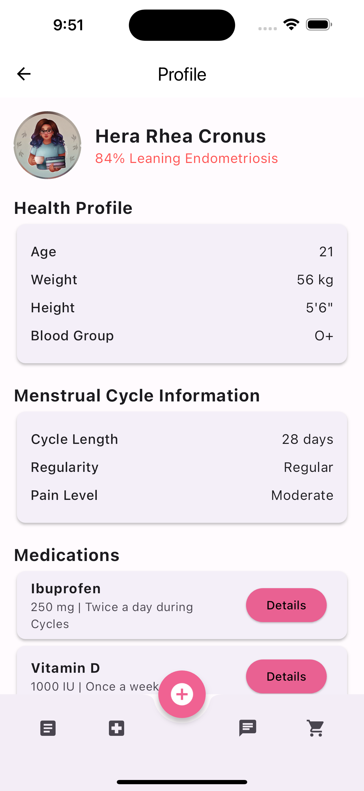

# 🩺 herahealthie

Problem Statement: 
An app that helps women better understand and manage their reproductive health through symptom analysis and early diagnosis of reproductive issues. 

## 📖 About the Project

This project is a for-credit mini project, started in Feb 2025, and due at the end of 3rd year 2nd Semester. This repository contains progress of the frontend, backend and machine learning models will be integrated soon. A few pages are shown below for reference! 

  
  
  
  

## 🌍 Introduction 
Despite comprising half of the global population, women’s health remains significantly underfunded and under-researched, leading to delayed diagnoses, limited treatment options, and diminished quality of life. Conditions such as endometriosis, adenomyosis, PCOS, and severe menstrual pain continue to affect millions of women, yet healthcare systems lack the necessary tools for early detection and personalized management.

HeraHealth is an AI-powered platform designed to bridge this gap by offering a comprehensive, personalized approach to reproductive health. 

## 🔑 Key Features 

🚀 MVP:
  1. Personalized Quiz for Profile Formation & Diagnosis 
  2. Menstrual Cycle Monitoring 
  3. Doctor-Ready Reports
  4. Chatbot (Emotional Support)
  5. Added Blogs and Shop after taking User Survey of Targeted Demographic

🚀 Planned Features (Post-April 2025):

  6. Medical Appointment Booking 
  7. X-Ray/Scan Analysis
  8. Telemedicine In-App
  9. Wearable Integration 

## 🛠️ Tech Stack (MVP)
Frontend: 

    Flutter Mobile Application 

Backend: 

    Firestore (Authentication, Notifications, Database)
  
    Machine Learning (Ensemble Learning, Random Forest)

## 📌 Progress 
✅ Completed

  1. Abstract – Defined problem statement, objectives, and scope.
  
  2. UML Diagrams – Designed use case diagrams, class diagrams, and sequence diagrams for system flow.
  
  3. System Architecture – Established frontend-backend-ML integration plan.

  4. Frontend Development (Flutter):
  
    Quiz Pages (Figma Designs)
    Calendar-Based cycle visualization
    Blogs Page 
    Shop
    Products Page
  
  5. Machine Learning Models

    Symptom-Based Diagnosis Model for PCOC and Endometriosis (Random Forest & Ensemble Learning)
  
🚧 In Progress
  1. Flutter Development for Frontend 
  2. Cycle Prediction Algorithm – Collecting sample datasets for AI training

⏭️ Next Steps
  1. Backend Development – Firestore database integration & API connections
  
  2. Chatbot, Doctor Ready Reports Frontend and Backend 
  
  3. AI Model Testing – Fine-tuning accuracy using real & synthetic data
  
  4. Beta Version Release – Internal testing & faculty review
