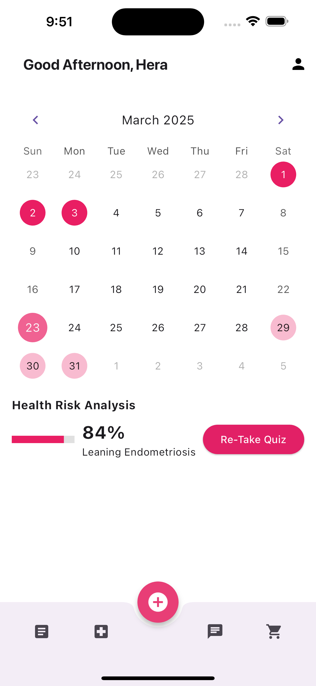
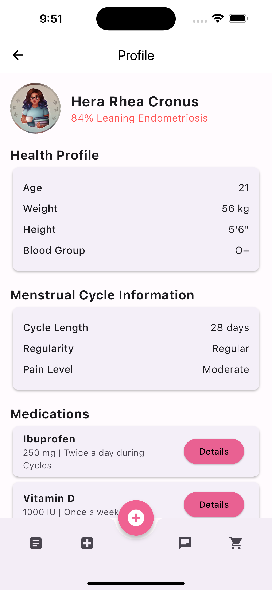
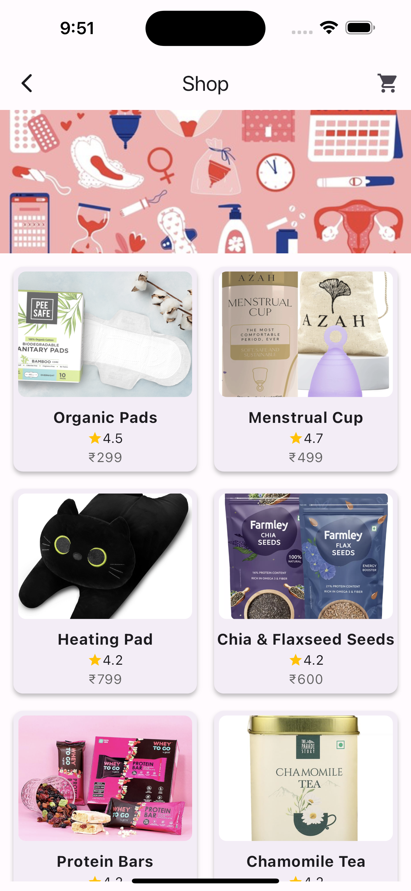
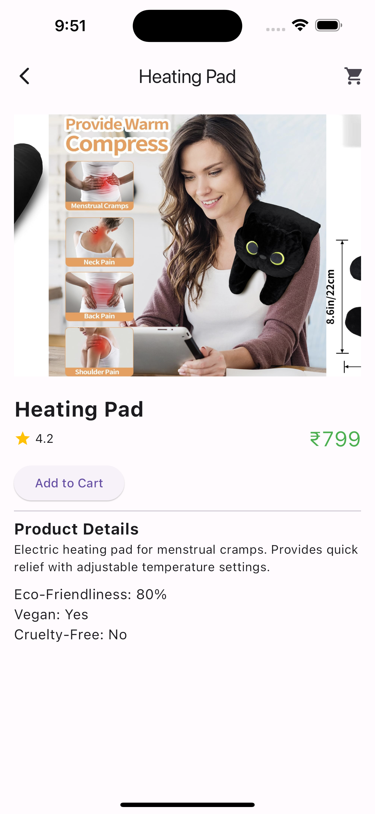

# 🩺 herahealthie

Model Preview:
https://github.com/user-attachments/assets/52ccdf82-855c-4a2d-8aa2-ed746d0afec7

Phase 1 Implementation Preview: https://drive.google.com/file/d/18CBHqDRdZbBAKRjqVHLiqfa8-oMnib01/view?usp=drive_link 

## Project Summary 

Problem Statement: To create an app that helps women better understand and manage their reproductive health through symptom analysis and early diagnosis of reproductive issues, specifically PCOS and endometriosis. 

### Features

Implemented (Phase 1, Feb-April 2025):
- Personalized Quiz for Profile Formation & Diagnosis (RF Model)
- Menstrual Cycle Monitoring (Static)
- Chatbot (Gemini API)
- Medical Appointment Booking (Frontend Only)\

Note: Added Blogs and Shop after taking User Survey of Targeted Demographic

<b>Phase 2 Plan (Feb 2026 onwards):</b>
- Ultrasound usage for prediction (ML Model) 
- Cycle Tracking → More Dynamic
- Medical Appointment Booking → Dynamic, can be expanded to Telemedicine in-app if time permits
- Chatbot → replace with an actual model, preferably edge. 
- Profile → extend to doctor ready reports. 
- Add support for vernacular languages
- (optional) Wearable Integration

## About the Project

This project is a for-credit mini project, started in Feb 2025, and due at the end of 3rd year 2nd Semester. This repository contains progress of the frontend, backend and machine learning models will be integrated soon. A few pages are shown below for reference! 

  
  
  
  

## 🌍 Introduction 
Despite comprising half of the global population, women’s health remains significantly underfunded and under-researched, leading to delayed diagnoses, limited treatment options, and diminished quality of life. Conditions such as endometriosis, adenomyosis, PCOS, and severe menstrual pain continue to affect millions of women, yet healthcare systems lack the necessary tools for early detection and personalized management.

HeraHealth is an AI-powered platform designed to bridge this gap by offering a comprehensive, personalized approach to reproductive health. 

## Tech Stack (MVP)
Frontend: 

    Flutter Mobile Application 

Backend: 

    Firestore (Authentication, Notifications, Database)
  
    Machine Learning (Ensemble Learning, Random Forest)

## Progress 
✅ Completed

  1. Abstract – Defined problem statement, objectives, and scope.
  
  2. UML Diagrams – Designed use case diagrams, class diagrams, and sequence diagrams for system flow.
  
  3. System Architecture – Established frontend-backend-ML integration plan.

  4. Frontend Development (Flutter):
  
    Quiz Pages (Figma Designs)
    Calendar-Based cycle visualization
    Blogs Page 
    Shop
    Products Page
  
  5. Machine Learning Models

    Symptom-Based Diagnosis Model for PCOC and Endometriosis (Random Forest & Ensemble Learning)
  
